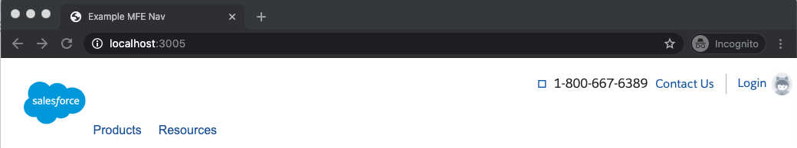

# Navigation as Micro Frontend 
## Example Implementation

An example of an LWC Micro Frontend (MFE) rendering the Navigation experience.




### Setup

#### NPM 


##### Homepage Global Framework

https://github.com/sfdc-www/hgf-www/tree/main/packages/lwc-components

“@sfdc-www/hgf-lwc-components": "^1.13.0”

##### .npmrc

```
registry=https://npm.pkg.github.com/sfdc-www
```

##### Login

```
npm login --scope=sfdc-www --registry=https://npm.pkg.github.com
```


```
npm install
```

### Building the MFE

```
npx webpack 
```

Webpack will produce a file 'hgfBundle.js' under /build/.

To view the latest build copy hgfBundle.js to /app/.
```
cp build/hgfBundle.js app
```

### Viewing the MFE

```
node app/app.js
```

Node should return:

```
Example MFE Nav available at http://localhost:3005
```
